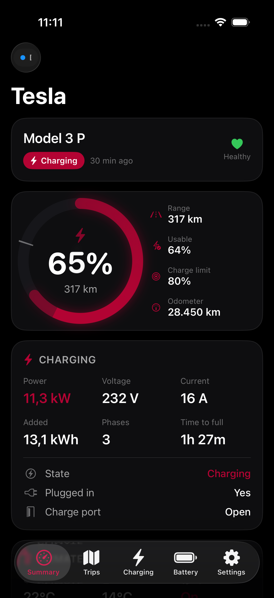
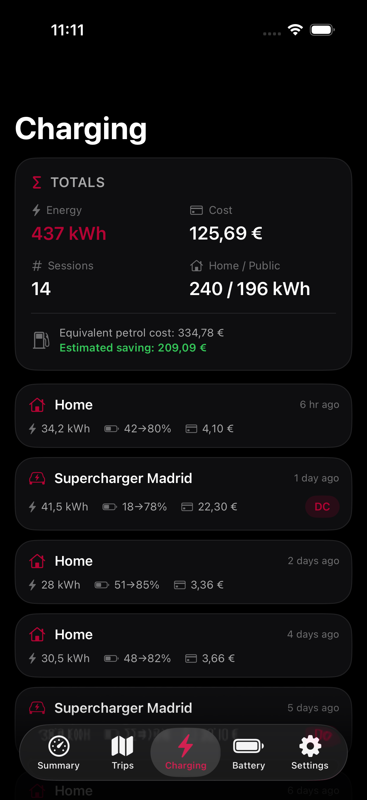
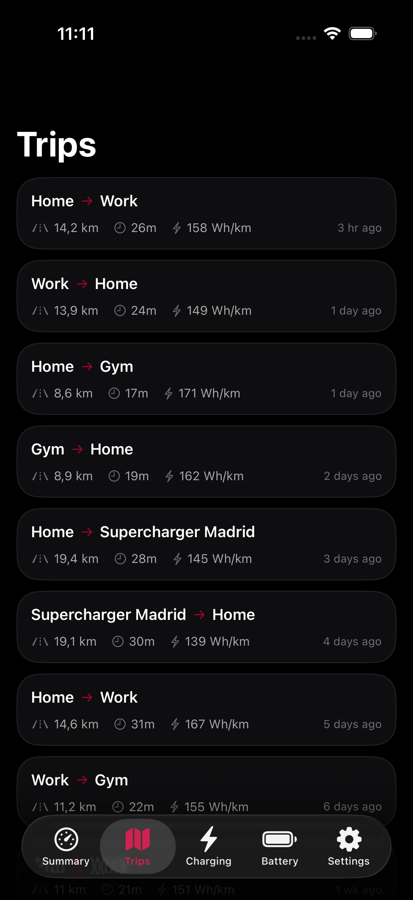
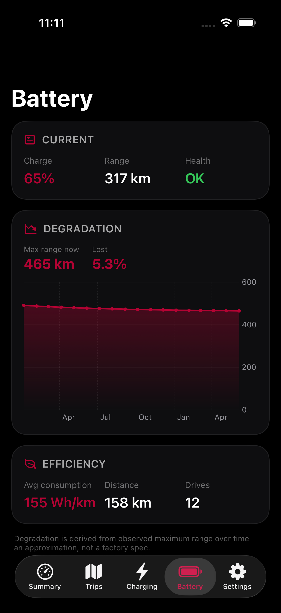
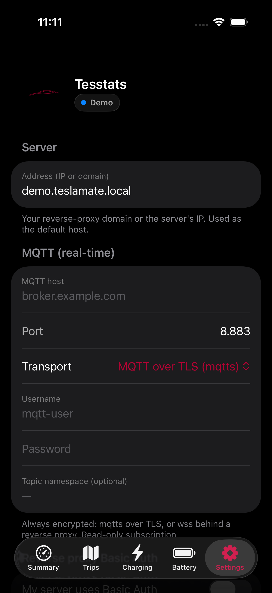
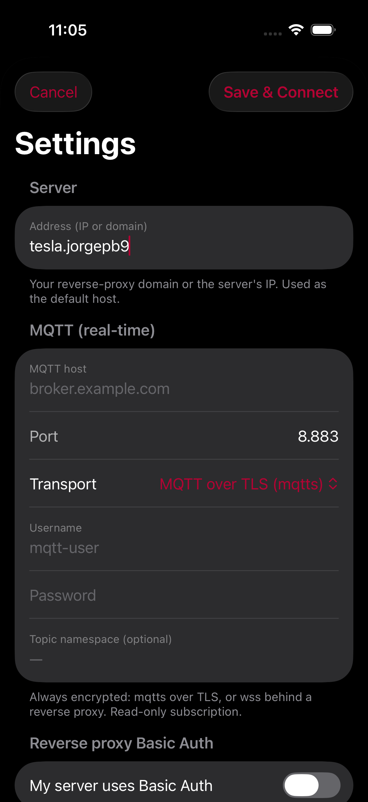

# Tesstats

**A beautiful, read‑only stats app for your Tesla — powered by your own [TeslaMate](https://github.com/teslamate-org/teslamate) server.**
For iPhone, iPad and Mac.

Tesstats shows your car's live status, trips, charging sessions, battery health and rich analytics — at a glance, in a clean dark interface. It **never sends any command to your car**: it only *reads* the data TeslaMate already collects.

<p align="center">
  
  
  
</p>
<p align="center">
  
  
  
</p>

---

## Table of contents

1. [What you get](#what-you-get)
2. [How it works (in plain English)](#how-it-works-in-plain-english)
3. [What you need before you start](#what-you-need-before-you-start)
4. [Step 1 — Get TeslaMate running](#step-1--get-teslamate-running)
5. [Step 2 — Make your data reachable from the app](#step-2--make-your-data-reachable-from-the-app)
   * [Option A — On your home Wi‑Fi, by IP (simplest)](#option-a--on-your-home-wi-fi-by-ip-simplest)
   * [Option B — From anywhere, via a reverse proxy (recommended)](#option-b--from-anywhere-via-a-reverse-proxy-recommended)
6. [Step 3 — Add history (TeslaMateApi, recommended)](#step-3--add-history-teslamateapi-recommended)
7. [Step 4 — Configure the app, field by field](#step-4--configure-the-app-field-by-field)
8. [Installing Tesstats](#installing-tesstats)
9. [Just want to look around? Demo mode](#just-want-to-look-around-demo-mode)
10. [Optional — instant push notifications](#optional--instant-push-notifications)
11. [Privacy & security](#privacy--security)
12. [Build from source](#build-from-source)
13. [License](#license)

---

## What you get

* **Live dashboard** — battery %, range, charging power, climate, locks/sentry, tire pressure, location, active route.
* **Trips** — every drive with distance, duration, consumption, a map and an elevation profile.
* **Charging** — every session with energy, cost, AC/DC, and a **real charge curve** (kW vs %SoC) for fast charges.
* **Battery health** — degradation over time (max range at 100 %, capacity, % lost).
* **Statistics** — monthly trends, this‑month‑vs‑last, records, cost per 100 km, CO₂ saved, consumption vs temperature, phantom drain, charging by location, and a calendar heatmap.
* **Notifications** — charging started/complete, charge limit reached, low tire pressure, doors/unlocked, geofence, software updates, quiet hours.
* **Apple goodies** — Home Screen & Lock Screen **widgets**, a **Live Activity** for charging (Dynamic Island), and **Siri/Shortcuts** ("What's my battery?").
* **Multi‑car**, offline cache, light/encrypted backups, CSV/JSON/GPX export, English & Spanish.
* On **Mac** it can live in the **menu bar** and keep notifying in the background.

---

## How it works (in plain English)

TeslaMate is a self‑hosted app that quietly logs everything about your Tesla into its own database. It publishes the **live** values to a small message broker called **MQTT**, and (optionally) exposes the **history** through a companion API called **TeslaMateApi**.

```
        Your Tesla ──▶ TeslaMate ──┬──▶ MQTT broker  (live values)   ──▶  📱 Tesstats
                                   └──▶ TeslaMateApi (trips/charges)  ──▶  📱 Tesstats
```

Tesstats just connects to those two and displays the data. That's it. Nothing is stored in the cloud, and the app can't drive, unlock or charge anything.

So to use Tesstats you need to (1) have TeslaMate running, and (2) let the app reach the **MQTT broker** (and ideally **TeslaMateApi**).

---

## What you need before you start

* A **Tesla** account already added to TeslaMate.
* A small **always‑on computer** to run TeslaMate: a Raspberry Pi, a NAS (Synology/Unraid), a mini‑PC, or a cloud VPS. It runs with **Docker**.
* About **20–30 minutes** the first time.
* An **iPhone/iPad** (iOS 18+) and/or a **Mac** (macOS 15+).

You do **not** need a Tesla developer account, a Fleet API key, or any paid service.

---

## Step 1 — Get TeslaMate running

If you already run TeslaMate, skip to [Step 2](#step-2--make-your-data-reachable-from-the-app).

TeslaMate has an excellent official guide — follow it first:
👉 **https://docs.teslamate.org/docs/installation/docker**

The short version (Docker Compose): you create a `docker-compose.yml` with four services — `teslamate`, a `database`, a `grafana` dashboard, and a **`mosquitto`** MQTT broker. You start it with `docker compose up -d`, open TeslaMate in your browser, and sign in with your Tesla account. After a few minutes TeslaMate starts recording, and **Mosquitto** starts receiving live values on topics like `teslamate/cars/1/battery_level`.

> 💡 The `mosquitto` service in that compose file is the **MQTT broker** Tesstats needs. By default it only listens *inside* Docker, so the next step is about letting your phone reach it safely.

---

## Step 2 — Make your data reachable from the app

Tesstats **always uses an encrypted MQTT connection** (it will not send your data or password in the clear). You have two ways to provide that. Pick one.

### Option A — On your home Wi‑Fi, by IP (simplest)

Best if you only use the app at home and don't have a domain name. You give Mosquitto a TLS certificate (self‑signed is fine) and point the app at your server's local IP.

1. **Find your server's local IP** (e.g. `192.168.1.50`).
2. **Create a self‑signed certificate** for Mosquitto (run on the server):
   ```bash
   mkdir -p mosquitto/certs && cd mosquitto/certs
   openssl req -x509 -nodes -newkey rsa:2048 -days 3650 \
     -keyout server.key -out server.crt \
     -subj "/CN=tesla-server"
   ```
3. **Tell Mosquitto to use TLS and require a password.** Create `mosquitto/config/mosquitto.conf`:
   ```conf
   per_listener_settings true

   listener 8883
   protocol mqtt
   cafile   /mosquitto/certs/server.crt
   certfile /mosquitto/certs/server.crt
   keyfile  /mosquitto/certs/server.key
   allow_anonymous false
   password_file /mosquitto/config/passwd
   ```
   Create a username/password (replace `tesstats`):
   ```bash
   docker compose exec mosquitto mosquitto_passwd -c /mosquitto/config/passwd tesstats
   ```
4. **Expose port 8883** for the mosquitto service in your `docker-compose.yml`:
   ```yaml
   mosquitto:
     # ...existing config...
     ports:
       - "8883:8883"
     volumes:
       - ./mosquitto/config:/mosquitto/config
       - ./mosquitto/certs:/mosquitto/certs
   ```
   Then `docker compose up -d`.
5. **In the app** (Settings → *Server*): set **MQTT host** = your IP, **Port** = `8883`, **Transport** = *MQTT over TLS (mqtts)*, fill in the **Username/Password** from step 3, and in *Security* turn on **"Trust a custom / self‑signed certificate."**

That's it — the app connects securely over your LAN.

### Option B — From anywhere, via a reverse proxy (recommended)

Best if you want to use the app **away from home** and/or you already have a domain name. A **reverse proxy** (we recommend **[Caddy](https://caddyserver.com/)** because it gets free HTTPS certificates automatically) sits in front of everything and exposes:

* `wss://your‑domain/mqtt` → Mosquitto's WebSocket listener (live data)
* `https://your‑domain/api` → TeslaMateApi (history)

1. Point a domain (e.g. `tesla.example.com`) at your server and open ports **80** and **443**.
2. **Enable Mosquitto's WebSocket listener.** In `mosquitto.conf`:
   ```conf
   listener 9001
   protocol websockets
   allow_anonymous false
   password_file /mosquitto/config/passwd
   ```
   (Create the password file as in Option A, step 3.)
3. **Add a Caddyfile** (Caddy fetches HTTPS certificates for you):
   ```caddyfile
   tesla.example.com {
       # Protect everything with one shared login (Basic Auth).
       basic_auth {
           myuser <bcrypt-hash>     # generate with: caddy hash-password
       }
       # Live MQTT over secure WebSocket
       reverse_proxy /mqtt* mosquitto:9001
       # History API
       reverse_proxy /api*  teslamateapi:8080
   }
   ```
4. **In the app** (Settings → *Server* and *Security*):
   * **MQTT host** = `tesla.example.com`, **Port** = `443`, **Transport** = *WebSocket Secure (wss)*, **WebSocket path** = `/mqtt`.
   * **MQTT Username/Password** = the Mosquitto login from step 2.
   * Turn on **"My server uses Basic Auth"** and enter the Caddy `myuser` login. (This is sent only over HTTPS.)
   * **TeslaMateApi base URL** = `https://tesla.example.com/api`.
   * Let's Encrypt certificates are trusted automatically — no extra security toggles needed.

> Prefer nginx, Traefik or a Cloudflare Tunnel? Any of them works — just expose the same two paths (`/mqtt` → mosquitto websockets, `/api` → teslamateapi) over HTTPS.

---

## Step 3 — Add history (TeslaMateApi, recommended)

Live MQTT alone gives you the dashboard. To also see **trips, charging sessions, battery degradation and the charge curve**, run **TeslaMateApi** — a tiny read‑only API for TeslaMate's database:

👉 **https://github.com/tobiasehlert/teslamateapi**

Add it to your compose file (it talks to the same TeslaMate database), then expose it:

* **Option A (LAN):** publish its port (e.g. `8080`) and set the app's **TeslaMateApi base URL** to `http://192.168.1.50:8080` — and turn on *Security → "Allow unencrypted (LAN only)"*.
* **Option B (reverse proxy):** expose it at `https://your‑domain/api` (as shown above) and set the base URL to `https://your‑domain/api` — no insecure toggle needed.

---

## Step 4 — Configure the app, field by field

Open Tesstats → **Settings** (the gear). Here's what every field means:

**Server**
| Field | What to put |
|---|---|
| Address (IP or domain) | Your server's IP or domain. Informational/default host. |

**MQTT (real‑time)**
| Field | Option A (LAN/TLS) | Option B (reverse proxy) |
|---|---|---|
| MQTT host | server IP | your domain |
| Port | `8883` | `443` |
| Transport | MQTT over TLS (mqtts) | WebSocket Secure (wss) |
| WebSocket path | — | `/mqtt` |
| Username / Password | Mosquitto login | Mosquitto login |
| Topic namespace | leave empty (unless you set a custom prefix in TeslaMate) | same |

**Reverse proxy Basic Auth** — turn on only for Option B if your proxy has a login.

**History API** — TeslaMateApi base URL (see Step 3).

**Security & certificates** — *Trust a custom / self‑signed certificate* for Option A; *Allow unencrypted (LAN only)* only if your API is plain `http://` on your LAN.

Tap **Test connection** to check both MQTT and the API, then **Save**. ✅

> 🔐 Your passwords are stored in the device **Keychain**, never in plain files. You can also export an **encrypted, password‑protected backup** of your whole configuration to set up a second device quickly (Settings → Data).

---

## Installing Tesstats

### iPhone / iPad — via AltStore (sideloading)

Tesstats isn't on the App Store, so you install the `.ipa` with **[AltStore](https://altstore.io)** (or SideStore), which re‑signs it with your own free Apple ID.

1. Install AltStore on your device (follow the instructions on altstore.io).
2. In AltStore → **Sources → +**, add this source URL:
   ```
   https://raw.githubusercontent.com/Drakonis96/tesstats/main/altstore.json
   ```
3. Open the **Tesstats** source and tap **Get / Install**.

> Or download `Tesstats.ipa` directly from the [latest release](https://github.com/Drakonis96/tesstats/releases/latest) and open it with AltStore.

### Mac — via DMG

1. Download `Tesstats-macOS.dmg` from the [latest release](https://github.com/Drakonis96/tesstats/releases/latest).
2. Open it and drag **Tesstats** to **Applications**.
3. The app is ad‑hoc signed (not notarized), so the first time **right‑click the app → Open → Open**.

On Mac you can close the window and Tesstats keeps running in the **menu bar**, showing live battery/range and sending notifications in the background.

---

## Just want to look around? Demo mode

Not set up yet? On the welcome screen tap **"Enable demo mode"** (or Settings → Vehicle → Demo). You'll get the full app filled with realistic sample data — **no network is contacted**.

---

## Optional — instant push notifications

iOS can't keep a background connection alive 24/7, so notifications only fire while the app is running. For **guaranteed alerts with the app closed** (e.g. a possible Sentry event), this repo includes a tiny **push microservice** in [`/server`](server) that listens to MQTT and sends Apple Push Notifications. It needs an Apple Push key (`.p8`). See [`server/README.md`](server/README.md). This is entirely optional — most people don't need it.

---

## Privacy & security

* **Read‑only.** Tesstats subscribes to MQTT and reads the API. It has no code to command the car.
* **No cloud, no telemetry, no trackers.** It talks only to *your* server.
* **Encryption by default.** MQTT is always `mqtts`/`wss`; the API must be `https` unless you explicitly allow plain `http` on your LAN.
* **Secrets in the Keychain.** Passwords never touch plain files; backups are AES‑256 encrypted with your own password.

---

## Build from source

```bash
# Requirements: macOS, Xcode 16+, and XcodeGen (brew install xcodegen)
git clone https://github.com/Drakonis96/tesstats.git
cd tesstats
xcodegen generate        # creates Tesstats.xcodeproj from project.yml
open Tesstats.xcodeproj   # build & run from Xcode
```

The Xcode project is generated from `project.yml`, so it isn't committed — always run `xcodegen generate` after cloning or pulling.

---

## License

Released under the MIT License. You're free to use, modify and share it. This project is not affiliated with Tesla, Inc. or the TeslaMate project. "Tesla" is a trademark of Tesla, Inc.
